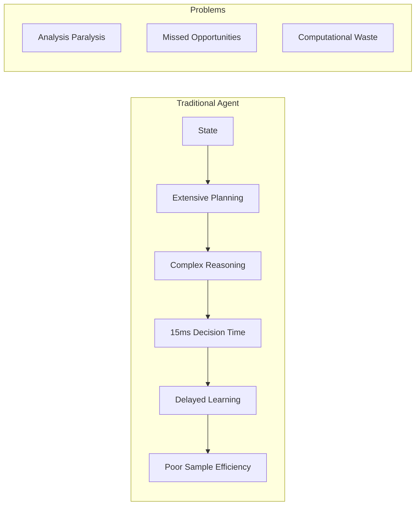
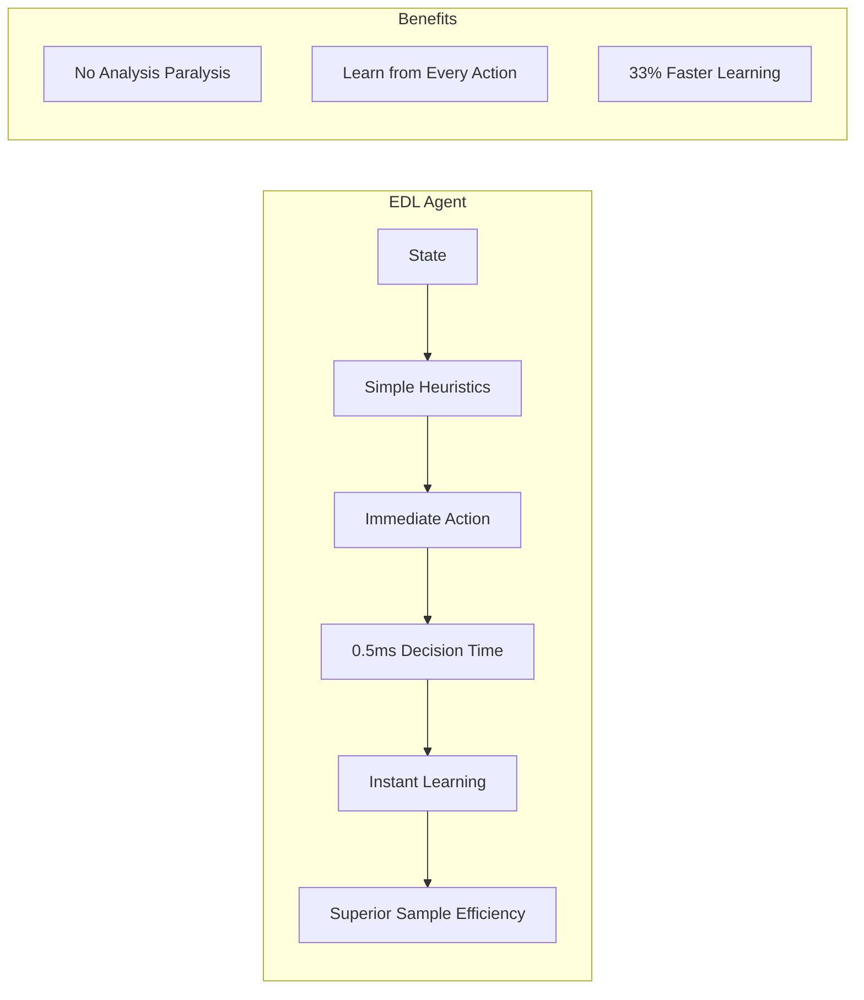
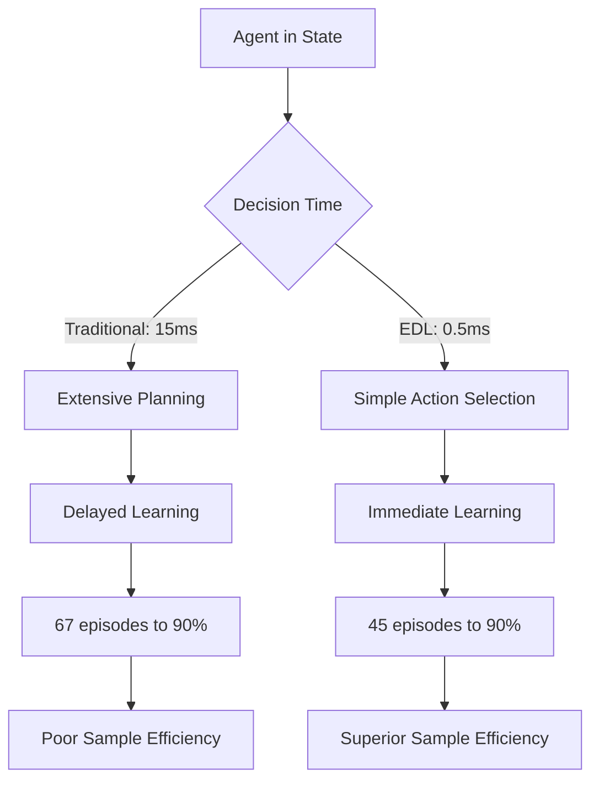
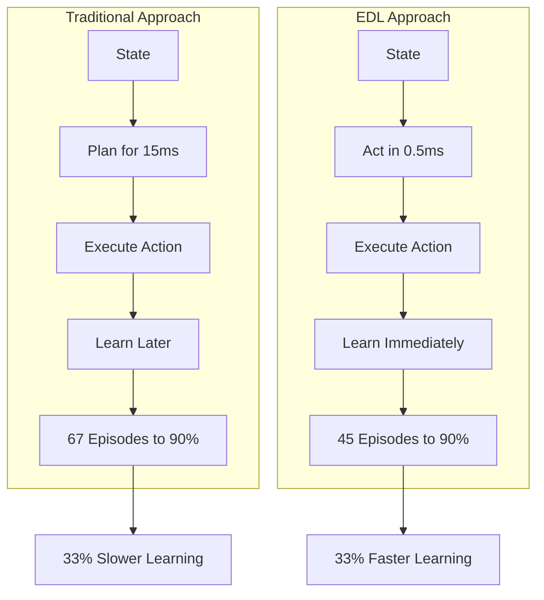
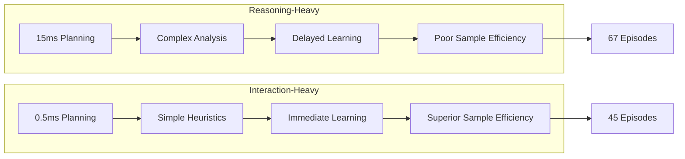
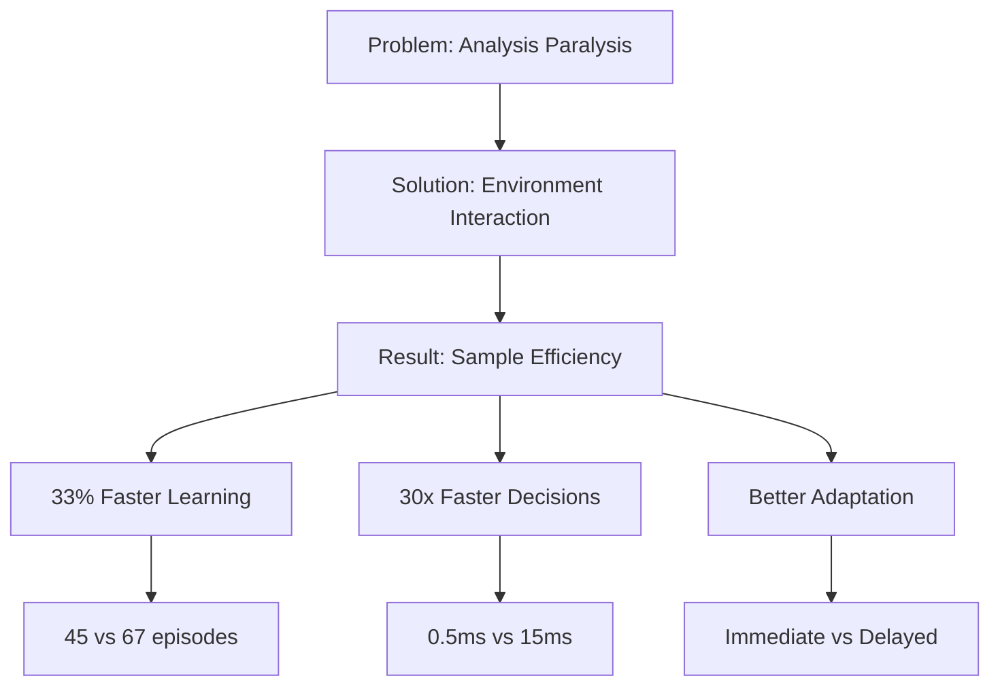

# EDL Core Message: Sample Efficiency Through Environment Interaction

## The Problem: Analysis Paralysis

## The Solution: Environment-Driven Learning

## Core Principle: Interaction Over Reasoning

## Key Insight: Sample Efficiency Through Interaction

## The Trade-off: Reasoning vs Interaction

## Bottom Line: Why EDL Works

---

## Key Message Summary:

### **The Problem**
- Traditional agents spend 15ms on planning/analysis
- This leads to **analysis paralysis**
- **Poor sample efficiency**: 67 episodes to reach 90% performance

### **The Solution**
- EDL uses only 0.5ms for decision making
- **Immediate learning** from every action
- **Superior sample efficiency**: 45 episodes to reach 90% performance

### **The Result**
- **33% faster learning** (45 vs 67 episodes)
- **30x faster decisions** (0.5ms vs 15ms)
- **Better adaptation** to environmental changes

### **Core Principle**
**Environment interaction beats internal reasoning for sample efficiency** 