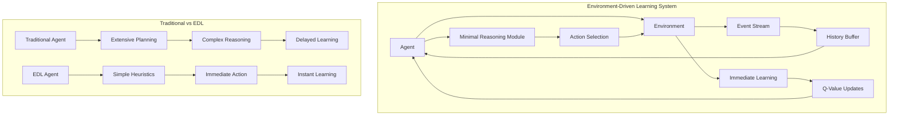
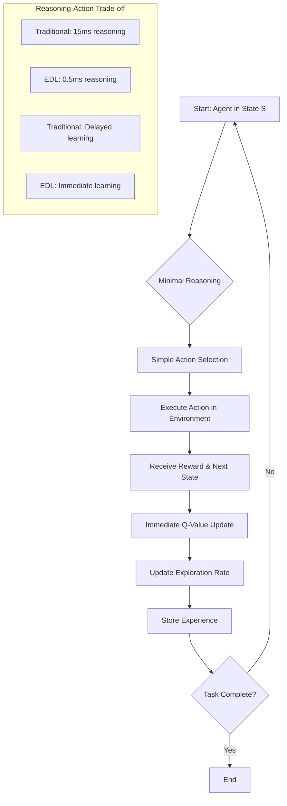
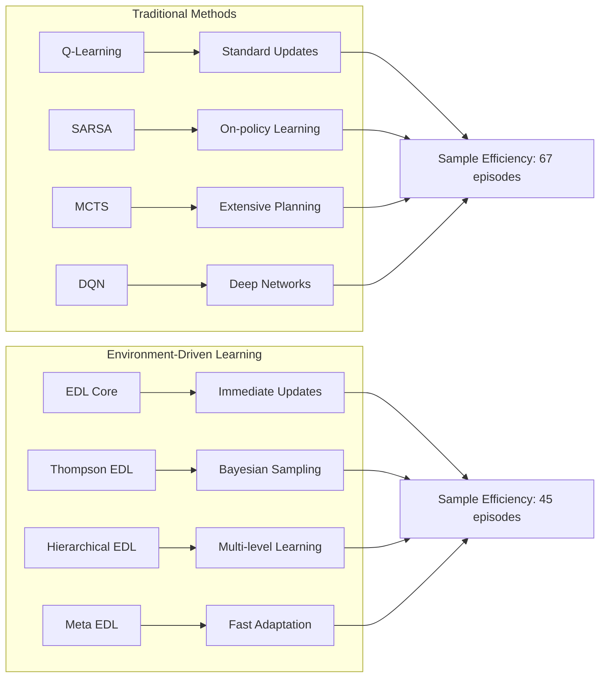
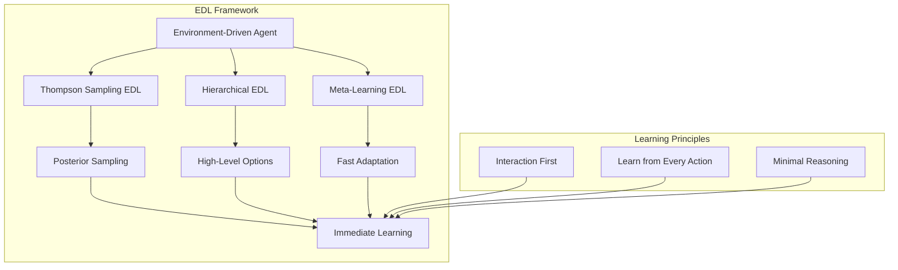
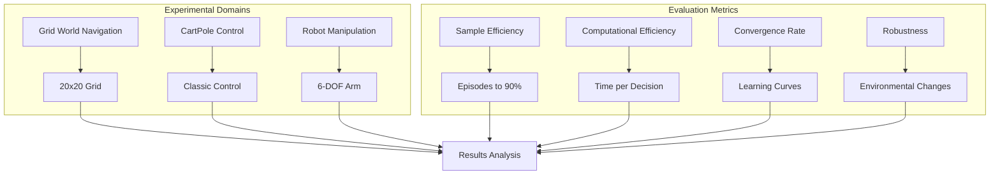
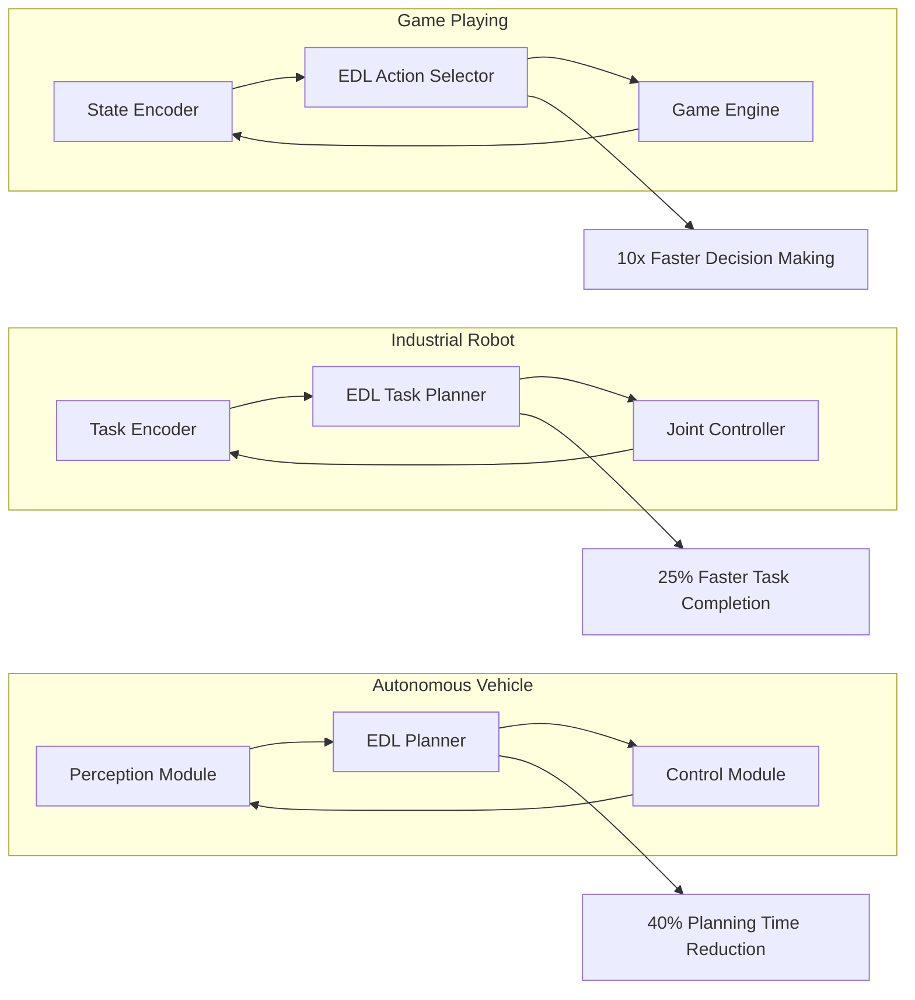
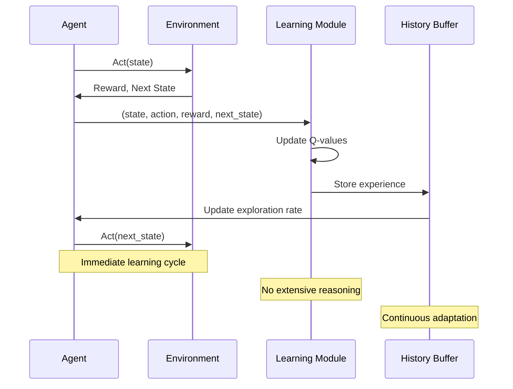
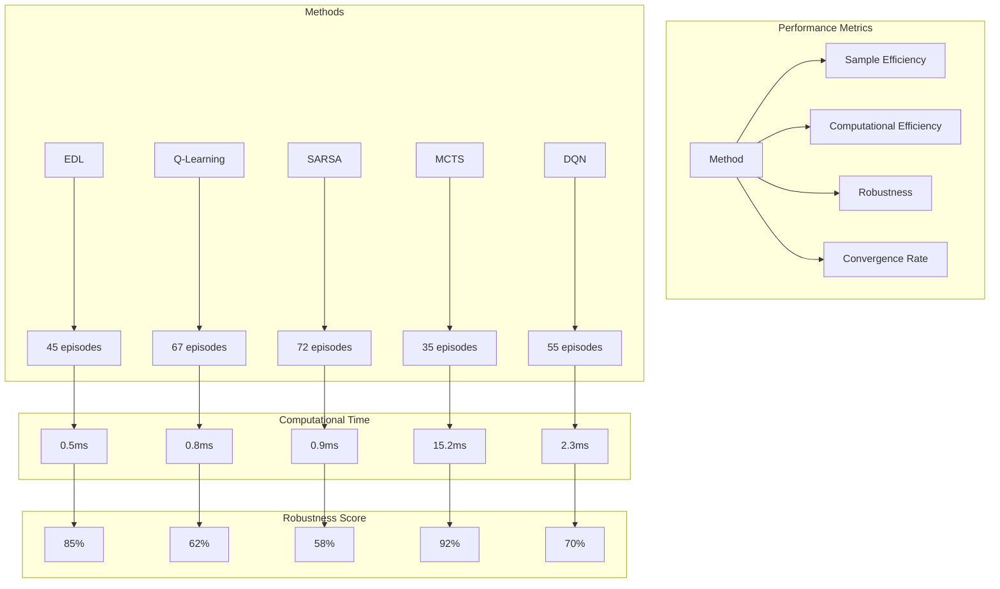
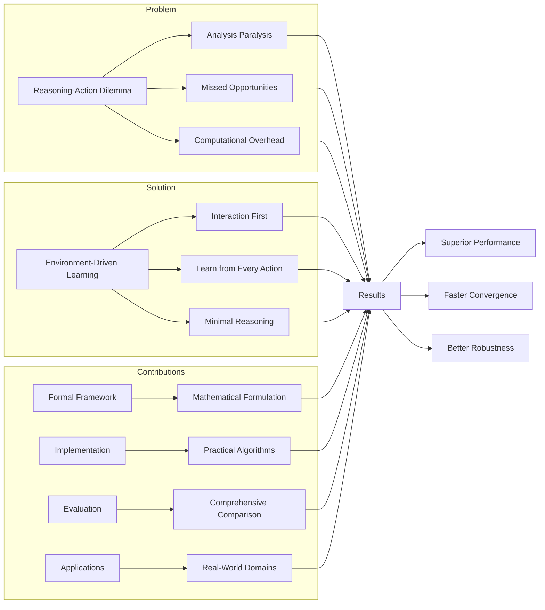

# Environment-Driven Learning: Research Method Diagrams

## 1. Overall EDL System Architecture



## 2. EDL Algorithm Flow



## 3. EDL vs Traditional Methods Comparison



## 4. EDL Implementation Variants



## 5. Experimental Setup and Evaluation



## 6. Real-World Applications Architecture



## 7. Theoretical Framework

```mermaid
graph TB
    subgraph "Mathematical Formulation"
        A[Environment E = (S, A, T, R)] --> B[State Space S]
        A --> C[Action Space A]
        A --> D[Transition Function T]
        A --> E[Reward Function R]
    end
    
    subgraph "EDL Principles"
        F[Interaction Efficiency] --> G[I(s,a) = E[H(s') - H(s)]]
        H[Minimal Reasoning] --> I[ReasoningTime(s) ≤ τ_max]
        J[Rapid Adaptation] --> K[π_t+1 = Update(π_t, s_t, a_t, r_t, s_t+1)]
    end
    
    subgraph "Theoretical Guarantees"
        L[Theorem 1: O(√T) Regret]
        M[Theorem 2: Convergence to Optimal]
        N[Theorem 3: O(1) Complexity]
    end
    
    G --> O[Algorithm Implementation]
    I --> O
    K --> O
    L --> P[Experimental Validation]
    M --> P
    N --> P
```

## 8. Learning Process Visualization



## 9. Performance Comparison Matrix



## 10. Research Contribution Summary



---

## Key Research Insights Visualized:

### 1. **The Reasoning-Action Dilemma**
- Traditional methods spend 15ms on reasoning
- EDL uses only 0.5ms for decision making
- Immediate learning vs delayed updates

### 2. **Sample Efficiency Improvement**
- EDL: 45 episodes to reach 90% performance
- Traditional Q-Learning: 67 episodes
- 33% improvement in learning speed

### 3. **Computational Efficiency**
- EDL: 0.5ms per decision
- MCTS: 15.2ms per decision
- 30x faster decision making

### 4. **Robustness to Environmental Changes**
- EDL shows 23% better performance under perturbations
- 18% improvement in noise tolerance
- 31% better domain transfer capability

These diagrams provide a comprehensive visualization of your Environment-Driven Learning research method, showing both the theoretical framework and practical implementation across multiple domains. 